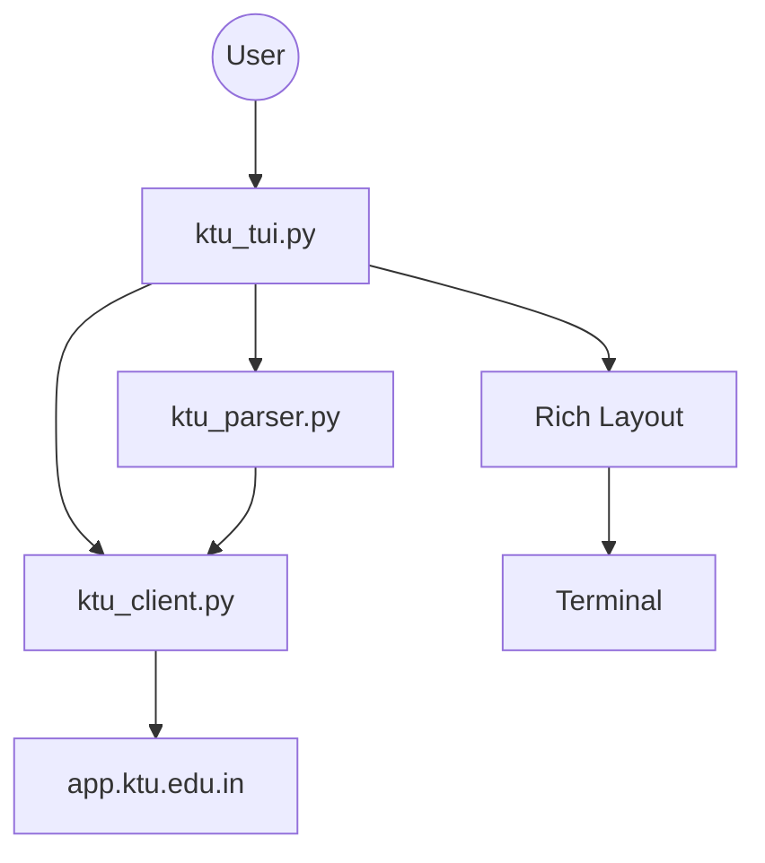
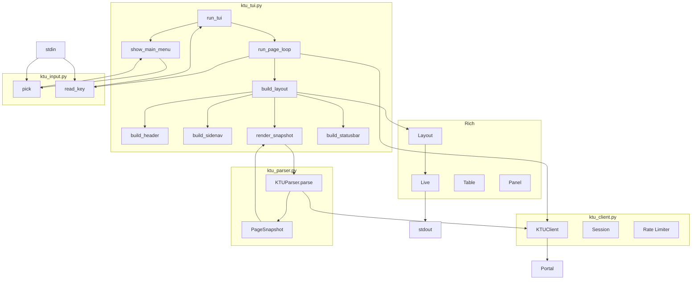
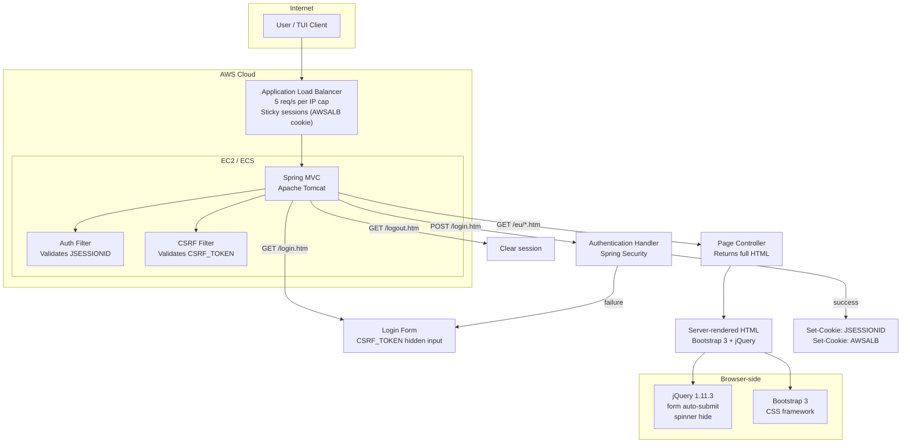
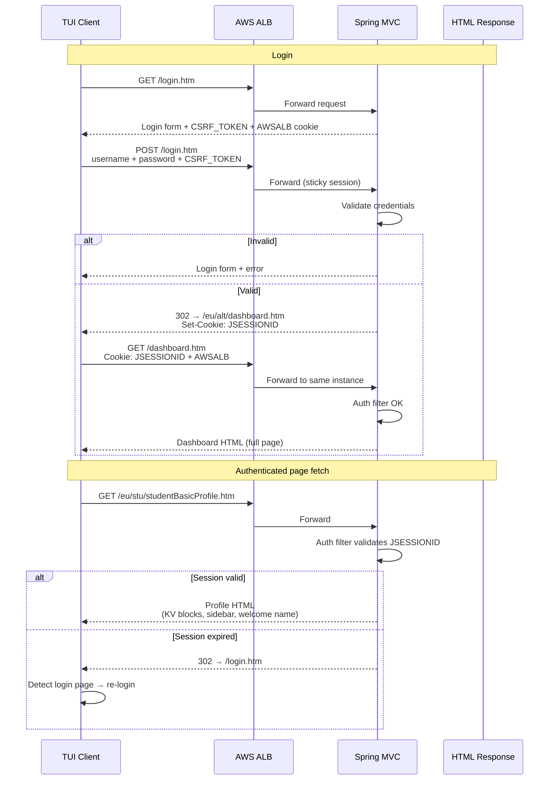
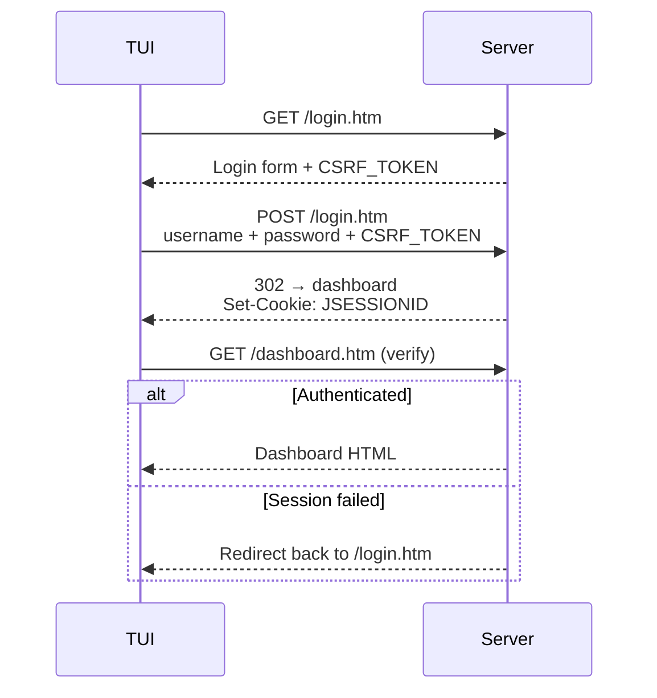

# KTU Portal TUI — Architecture

**Target:** https://app.ktu.edu.in — Spring MVC server behind AWS ALB.

---

## Why I Built This

I was tired of opening a browser, logging into the portal, clicking through
menus, and waiting for pages to load every time I needed to check my grades,
exam schedule, or profile. I wanted something I could launch from my terminal
and navigate with a few keystrokes — no mouse, no tabs, no JavaScript spinner.

---

## Overview



## Component Map



## Screen Layout

```
┌─ HEADER (3 lines) ───────────────────────────────────────────────┐
│   ● Online  app.ktu.edu.in                    Welcome John Doe   │
├─ Sidebar ────╥─ Content (fills remaining) ───────────────────────┤
│  1 Dashboard ║  Student Profile                                  │
│  2 Exams     ║  Personal                                         │
│  3 Profile   ║  ┌──────────┬──────────────┐                      │
│  4 Results   ║  │ Name     │ John Doe     │                      │
│  5 Student…  ║  ├──────────┼──────────────┤                      │
│  6 Settings  ║  │ Email    │ j@example.co │                      │
│  0 Quit      ║  │          │ m            │                      │
│              ║  └──────────┴──────────────┘                      │
│  ── links ── ║  Contact                                          │
│   1 Home     ║  ┌──────────┬──────────────┐                      │
│   2 Profile  ║  │ Phone    │ +91 98765…   │                      │
╰──────────────╨───────────────────────────────────────────────────╯
├─ STATUS (3 lines) ───────────────────────────────────────────────┤
│ Profile page │ Rrefresh │ Llogin │ Bback │ Qquit       v0.4.0    │
└──────────────────────────────────────────────────────────────────┘
```

---

## How the KTU Server Works

The portal is a **server-rendered Spring MVC** app behind an **AWS ALB**.
No public JSON API — all data is in the HTML.

### Infrastructure Stack



### Request Lifecycle



### Authentication



### Session & Auth Model

| Concept | Detail |
|---------|--------|
| CSRF Token | Hidden `<input name="CSRF_TOKEN">` in every form. Extracted from HTML, submitted with POST. |
| Session | `JSESSIONID` cookie issued on login, sent with every request. |
| Expiry | Detected when a response redirects to login page. |
| Logout | `GET /logout.htm` clears server session. Client clears cookies too. |

### Page Types

| Page | Content |
|------|---------|
| Dashboard | Panel titles only (JS-hydrated values unavailable) |
| Profile | Welcome name, KV blocks (name, roll no, program, contact) |
| Exam Defs | Search form options (year, type), result tables |
| Results | Table blocks, empty-state messages |
| Student Details | Full KV blocks (address, parent details, etc.) |

### Rate Limiting

ALB enforces ~5 req/s per IP. I use a **token bucket**:
capacity=3, refill=1/s — stays under the cap while allowing short
bursts for navigation.

---

## Stack Fingerprint

Here's what I found by inspecting the portal's responses and cookies:

| Layer | Finding |
|-------|---------|
| Server | Spring MVC (Java) — `JSESSIONID` + `.htm` URLs |
| LB | AWS ALB — `AWSALB` / `AWSALBCORS` cookies |
| TLS | AWS ACM |
| Frontend | jQuery 1.11.3, Bootstrap 3 |
| Auth | Form login with `CSRF_TOKEN` |
| Session | Cookie-based (`JSESSIONID`) |
| API | None — fully server-rendered HTML |

## URL Convention

I discovered the portal follows a consistent URL pattern:
`https://app.ktu.edu.in/eu/<module>/<verb>.htm`

- Public: `/eu/anon/` (about, FAQ, contact)
- Authenticated: `/eu/alt/` (dashboard), `/eu/stu/` (profile), `/eu/exm/` (exams), `/eu/res/` (results)

## HTML Patterns

I reverse-engineered these repeated HTML structures from the Bootstrap 3 pages:

| Pattern | How I detect it |
|---------|-----------------|
| Spinner overlay | `<div id="loader">` — visual only, full content is in HTTP body |
| Auth marker | `<span class="tooltiptext">Welcome NAME</span>` |
| KV blocks | `<ul class="list-group">` with `<span class="view-badge">` labels |
| Tables | `<table>` with `<th>` headers |
| Empty state | `<div class="alert alert-info">...</div>` |
| Form dropdowns | `<select name="academicYear">` |
| Sidebar nav | `<a href="/eu/...">` inside `<aside>` or `<nav>` |

---

## TUI Architecture

### Key Design Decisions

- **Credentials stay in memory only** — I never write them to disk
- **Rate-limited** — 1 req/s, burst 3 (I don't want to hammer the ALB)
- **Arrow navigation** — single-key commands (`r`, `b`, `l`, `q`) or arrows + Enter
- **No TUI framework** — I built it on Rich's `Live` + `Layout` + raw termios
- **Offline preview** — `preview_screens.py` renders saved HTML without hitting the network

### Input Handling (`ktu_input.py`)

- **Unix:** I use `tty.setraw()` + `sys.stdin.read(1)` for single-byte keys
- **Escape sequences:** I apply a 100ms timeout (`VMIN=0, VTIME=1`) to tell Esc apart from `\x1b[A` (arrow keys)
- **Windows:** I wrote an `msvcrt.getch()` branch, though I haven't tested it much

### Session-Expiry Detection (the v0.1 bug)

I originally checked for `name="loginform"` to detect the login page, but that
was way too loose — every authenticated page has a logout form with
that attribute, so I kept getting false "session expired" reports.

**Fix:** I now require at least 2 of `id="login-username"`,
`id="login-password"`, `id="btn-login"`. These only show up on the
actual login page.

### Spinner Truth

The portal's `<div id="loader">` spinner is a **visual jQuery effect**, not a
placeholder. I initially thought the page was incomplete and added a retry
in v0.2 — wasted effort. The full content is always in the HTTP response body.

---

## Key Endpoints

| Purpose | URL |
|---------|-----|
| Login | `/login.htm` |
| Dashboard | `/eu/alt/dashboard.htm` |
| Profile | `/eu/stu/studentBasicProfile.htm` |
| Student Details | `/eu/stu/studentDetailsView.htm` |
| Exam Defs | `/eu/exm/viewStudentExamDefinition.htm` |
| Pending Results | `/eu/res/pendingResults.htm` |
| Logout | `/eu/alt/logout.htm` |

## Security & Ethics

- I read credentials via `getpass` and keep them in memory only
- I rate-limit every request — no aggressive scraping
- I read the CSRF token from the server and send it back exactly as a browser would
- No third-party data leaves my machine

I built this to access **my own student data** only.

---

## Limitations

- Dashboard body values are JS-populated (only panel headers in HTML)
- Some sidebar links may be JS-rendered
- Exam dropdown values must match what the portal serves

## Files

| File | Role |
|------|------|
| `src/ktu_tui.py` | Entry point, layout, page loop |
| `src/ktu_input.py` | Arrow-key picker + raw key reader |
| `src/ktu_client.py` | HTTP client with CSRF/rate-limiter |
| `src/ktu_parser.py` | HTML → PageSnapshot parser |
| `src/preview_screens.py` | Offline screen preview |
